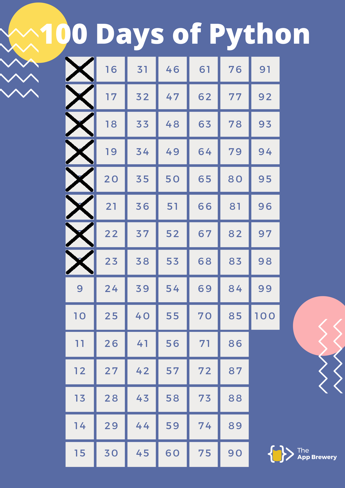

Exercícios e mini projetos do curso "100 Days of Code: The Complete Python Pro Bootcamp for 2022" - adquirido na Udemy.

Rodando no Visual Studio Code com a extensão Code Runner.

Link do curso:
https://www.udemy.com/course/100-days-of-code/

